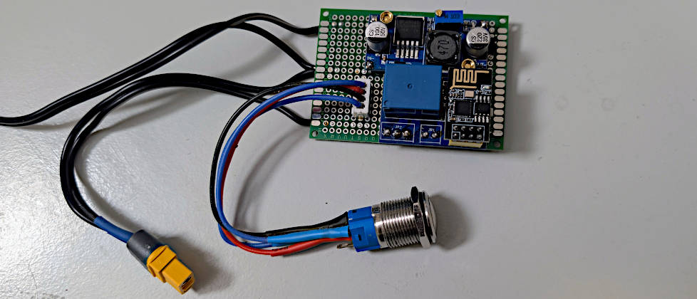

# VW T4 Smart Shower (ESP8266)

Eine smarte, ultra-kompakte und zeitgesteuerte Steuerung für eine 12V-Tauchpumpe (Camping-Dusche), speziell entwickelt für den begrenzten Platz (C-Säule) im VW T4 Multivan.

Eine ausführliche Schritt-für-Schritt-Bauanleitung sowie weitere Hintergrundinformationen findest du auf meinem Blog: [xtramp.de - VW T4 Dusche nachrüsten](https://xtramp.de/wp/vw-t4-dusche-nachruesten-esp8266/)

## Projekt-Highlights

* **Auto-Off Timer:** Die Pumpe schaltet sich nach einer definierten Zeit automatisch ab (Schutz vor Trockenlaufen und Wasserverschwendung).
* **WLAN & Web-Interface:** Der ESP8266 spannt einen eigenen Access Point ("T4 SmartShower") auf. Die Dusche kann per Smartphone bedient werden.
* **Echtzeit-Synchronisierung:** Das Web-Interface synchronisiert sich via AJAX in Echtzeit mit dem physischen Hardware-Taster.
* **EEPROM Speicher:** Die gewünschte Laufzeit kann über das Web-Interface in Sekunden eingegeben werden und bleibt auch nach einem Stromausfall (oder Abklemmen der Batterie) dauerhaft gespeichert.
* **Low-Profile Design:** Durch das Auslöten der Buchsenleiste auf dem Relais-Modul wird eine extrem flache Bauhöhe (unter 18mm) erreicht.

## Hardware & Stückliste

* 1x ESP8266 ESP-01S
* 1x ESP-01S Relay Module v4.0 (5V Version mit AMS1117 Regler)
* 1x LM2596S DC-DC Step-Down Wandler (Alternative für extrem wenig Platz: Mini-360 DC-DC Wandler - Achtung: verträgt nur max. 23V Spannungsspitzen)
* 1x Wasserdichter Edelstahl-Vandalismus-Taster (mit 12V LED-Ring)
* 3D-gedrucktes Gehäuse (Materialempfehlung für den KFZ-Bereich: PETG oder ABS)

## Verkabelung

1. **Stromversorgung:** 12V Bordnetz an den Eingang des Step-Down-Wandlers. Den Ausgang mit einem Multimeter exakt auf **5.0V** einstellen.
2. **Relais-Modul:** Die 5.0V vom Step-Down-Wandler an VCC und GND des Relais-Moduls anschließen.
3. **Pumpe:** Den Pluspol der Pumpe über den Schließerkontakt (COM zu NO) des Relais leiten.
4. **Taster (Hardware-Hack):** Da der GPIO 0 Pin beim ESP8266 empfindlich auf beim Booten gedrückte Taster reagiert, wird der Hardware-Taster an den **RX-Pin** (GPIO 3) und an **GND** gelötet.

## Flashen des ESP-01S

Da herkömmliche USB-Adapter oft nicht genug Strom liefern oder Timing-Probleme haben, wird die **Bridge-Methode** empfohlen:
Nutze ein anderes Board (z.B. Wemos D1 oder Arduino Uno Format) als Brücke.

* **RST auf GND** am Programmer-Board (deaktiviert den Hauptchip).
* **RX auf RX** und **TX auf TX** (Signale werden 1:1 durchgeschleift).
* GPIO 0 des ESP-01S beim Einstecken auf GND legen (Flash-Modus).

Nutze die Arduino IDE (Board: Generic ESP8266 Module) zum Hochladen der `t4_smart_shower.ino`.

## Autor

**Fred Fiedler** Fotograf und Fernwehgeplagter  
GitHub: [Casaluifred](https://github.com/Casaluifred)
